# CMSC848F - Assignment 1: Rendering Basics with PyTorch3D   (Total: 100 Points)
**Credit**: This assignment is modified from [CMU 3D Vision course](https://learning3d.github.io/). 

**Author**: Nishant Awdeshkumar Pandey  
**UID**: 119247556
### Folder structure
In the directory where this file is located, following folders can be found:
1. data: Necessary data for rendering. 
2. GIF: All the output GIFs.
3. images: All the output images.
4. report: Final report for the assignment. 
4. starter: All the code files.

**All commands below need to be run inside the folder in which this file is present**
### 0.1 Rendering your first mesh (5 points)

The code for this question is available on `starter/render_mesh.py`, which loads
a sample cow mesh and renders it.If you run `python -m starter.render_mesh`, you should see
the following output in the images folder by the name cow.jpg:

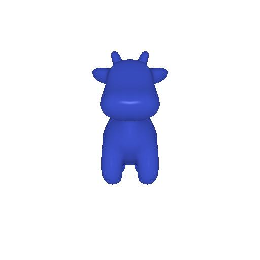  

## 1. Practicing with Cameras 

### 1.1. 360-degree Renders (5 points)

The code for this section is written in starter/render_gif.py
To get the output run `python -m starter.render_gif`
I have created a new folder named GIF to store all the GIFs required. You should
see the following output in the GIF folder by the name my_gif.gif:

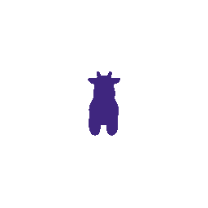  
## 1.2 Re-creating the Dolly Zoom (15 points)
The code for this section is written in starter/dolly_zoom.py
You can render your gif by calling `python -m starter.dolly_zoom`. 
you should see the following output in the GIF folder by the name dolly.gif:
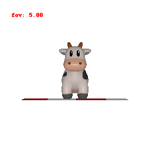

## 2. Practicing with Meshes   

### 2.1 Constructing a Tetrahedron (5 points)
The code for this section is written in starter/render_tetra.py
You can render your gif by calling `python -m starter.render_tetra. 
you should see the following output in the GIF folder by the name tetra.gif:

### 2.2 Constructing a Cube (5 points)
The code for this section is written in starter/render_cube.py
You can render your gif by calling `python -m starter.render_cube. 
you should see the following output in the GIF folder by the name cube.gif:

## 3. Re-texturing a mesh (15 points)
The code for this section is written in starter/render_tex.py
You can render your gif by calling `python -m starter.render_tex. 
you should see the following output in the GIF folder by the name cow_tex.gif:
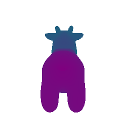
## 4. Camera Transformations (15 points)
The code for this section is written in starter/camera_transforms.py.

There are five different orientation of the cow. One original and four transforms.
To get the output for each case there are commands that need to be uncommented:
1. For the viewing the original image, uncomment line 19,20,62, and comment the 
rest of the lines from 21-32 and 63-70.
2. For the viewing the first transform, uncomment line 22,23,64, and comment the 
rest of the lines 19,20,62,24-32 and 65-70.
Do similar changes to view second and third and fourth transform

You can render your gif by calling `python -m starter.camera_transforms. 
You should see the following outputs in the image folder by the names original_transform_cow.jpg,first_transform_cow.jpg,
second_transform_cow.jpg, third_transform_cow.jpg, fourth_transform_cow.jpg:
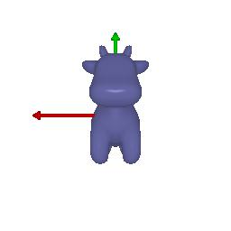
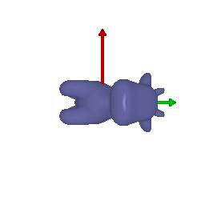
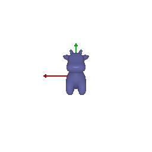
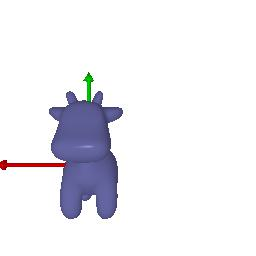
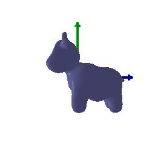

## 5. Rendering Generic 3D Representations 
### 5.1 Rendering Point Clouds from RGB-D Images (15 points)
The code for this section is written in starter/render_generic.py
You can render your gif by calling `python -m starter.render_generic --render point_cloud. 
You should see the following output in the GIF folder by the name plant1.gif, plant2.gif, plant3.gif:

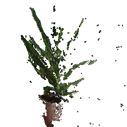
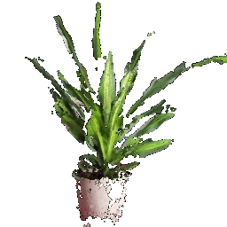
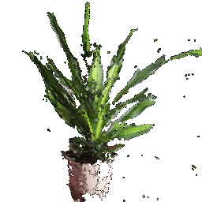

plant1.gif->first point cloud.
plant2.gif->second point cloud.
plant3.gif->Point cloud made using the union of the three point clouds.
### 5.2 Parametric Functions (10 points)
The code for this section is written in starter/render_generic.py
You can render a torus point cloud by calling `python -m starter.render_generic --render parametric --num_samples 2000`.
You should see the following output in the GIF folder by the name torus.gif:

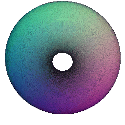

### 5.3 Implicit Surfaces (10 points)
The code for this section is written in starter/render_generic.py.
A Torus mesh can be constructed implicitly and rendered by calling
`python -m starter.render_generic --render implicit`.

You should see the following output in the GIF folder by the name implicit_torus.gif:

